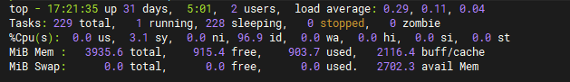

## 前言

2021 年双十一购买了 3 年的腾讯轻量应用服务器（2 核 4G），于是想学习搭建一套私有化自动部署。本系列是整理的搭建过程中的笔记，记录了部署时碰到的各种问题。

日常交流中，发现大多前端工程师对服务器、Docker 等应用都极为陌生。为了尽量照顾到这些朋友，文章写的比较小白化，觉得有所啰嗦的朋友敬请谅解。

但由于只是一个搭建私有化自动部署系统的文章，所以也只会简单的提到 服务器、Docker Nginx 等应用概念和操作。 感觉有些云里雾里的朋友也请敬请谅解

由于个人表达能力有限，文章内可能会出现语句不顺、错句等情况，敬请谅解。

## 技术选型

由于服务器仅为 2 核 4G，所有服务都采用了轻量级应用，整套方案部署完成后内存仅占用 **900M** 左右。

但由于采用的全是轻量级解决方案，所以某些服务并没有采用广泛使用的企业级应用。例如：`Gitea`、`Drone`
本来也是想着全部采用那些被广泛使用的企业级应用，例如： `Gitlab` 、`K3S`等，但部署时才发现真心是条件不允许，小服务器根本承担不了这些应用。

## 目录

 * [00-腾讯云环境配置](https://github.com/yanzhangshuai/lightweight-deploy-blogs/blob/main/md/00-%E8%85%BE%E8%AE%AF%E4%BA%91%E7%8E%AF%E5%A2%83%E9%85%8D%E7%BD%AE.md)
 * [01-环境配置（上）](https://github.com/yanzhangshuai/lightweight-deploy-blogs/blob/main/md/01-%E7%8E%AF%E5%A2%83%E9%85%8D%E7%BD%AE%EF%BC%88%E4%B8%8A%EF%BC%89.md)
 * [01-环境配置（下）](https://github.com/yanzhangshuai/lightweight-deploy-blogs/blob/main/md/01-%E7%8E%AF%E5%A2%83%E9%85%8D%E7%BD%AE%EF%BC%88%E4%B8%8B%EF%BC%89.md)
 * [02-Nginx网关服务](https://github.com/yanzhangshuai/lightweight-deploy-blogs/blob/main/md/02-Nginx%E7%BD%91%E5%85%B3%E6%9C%8D%E5%8A%A1.md)
 * [03-web项目服务（上）](https://github.com/yanzhangshuai/lightweight-deploy-blogs/blob/main/md/03-web%E9%A1%B9%E7%9B%AE%E6%9C%8D%E5%8A%A1%EF%BC%88%E4%B8%8A%EF%BC%89.md)
 * [03-web项目服务（下）](https://github.com/yanzhangshuai/lightweight-deploy-blogs/blob/main/md/03-web%E9%A1%B9%E7%9B%AE%E6%9C%8D%E5%8A%A1%EF%BC%88%E4%B8%8B%EF%BC%89.md)
 * [04-私有代码仓库](https://github.com/yanzhangshuai/lightweight-deploy-blogs/blob/main/md/04-%E7%A7%81%E6%9C%89%E4%BB%A3%E7%A0%81%E4%BB%93%E5%BA%93-Gitea.md)
 * [05-持续部署服务-Drone（上）](https://github.com/yanzhangshuai/lightweight-deploy-blogs/blob/main/md/05-%E6%8C%81%E7%BB%AD%E9%83%A8%E7%BD%B2%E6%9C%8D%E5%8A%A1-Drone%EF%BC%88%E4%B8%8A%EF%BC%89.md)
 * [05-持续部署服务-Drone（下）](https://github.com/yanzhangshuai/lightweight-deploy-blogs/blob/main/md/05-%E6%8C%81%E7%BB%AD%E9%83%A8%E7%BD%B2%E6%9C%8D%E5%8A%A1-Drone%EF%BC%88%E4%B8%8B%EF%BC%89.md)
 * [06-私有镜像仓库-Harbor](https://github.com/yanzhangshuai/lightweight-deploy-blogs/blob/main/md/06-%E7%A7%81%E6%9C%89%E9%95%9C%E5%83%8F%E4%BB%93%E5%BA%93-Harbor.md)
 * [07-私有NPM仓库-Verdaccio](https://github.com/yanzhangshuai/lightweight-deploy-blogs/blob/main/md/07-%E7%A7%81%E6%9C%89NPM%E4%BB%93%E5%BA%93-Verdaccio.md)

## 基础设施、工具
1. Ubuntu Server 20.04 LTS 服务器
2. [WindTerm](https://github.com/kingToolbox/WindTerm)（SSH链接工具）和 [WinSPC](https://winscp.net/eng/index.php)（FTP传输工具）。
3. 已备案域名。使用到了 `HTTPS` 协议 、 子域名 和 搭建 `网关服务` 代理了各种应用。
