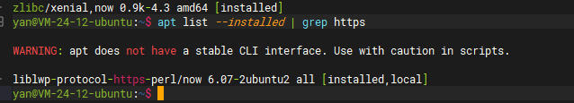
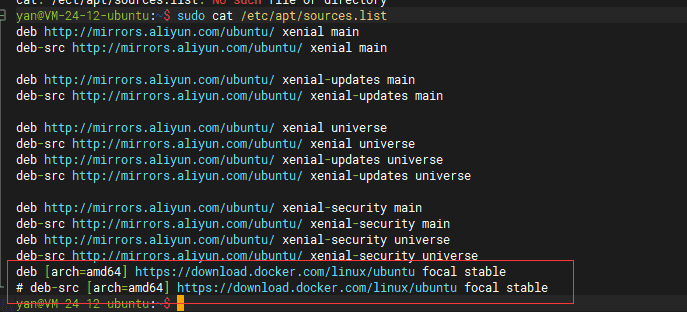
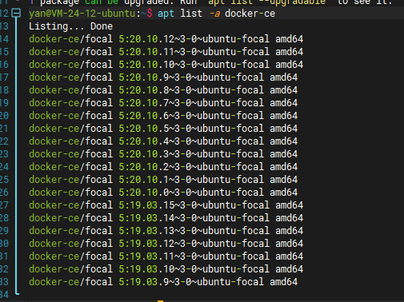
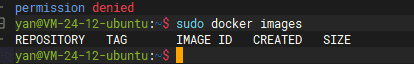
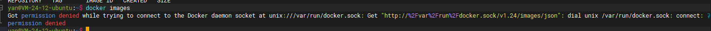
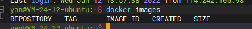
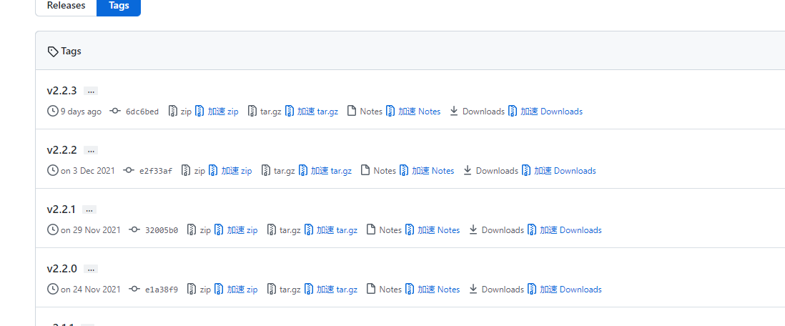
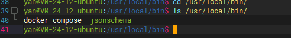
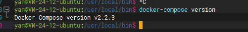

[TOC]
# Docker

## Docker简单概念
`Docker` 是一种`容器化技术`，主要是用于隔离应用之间的边界问题。
`Docker` 最常见的两个概念是：`镜像(Image)`、`容器(Container)`。

### 镜像（Image）

`镜像(Image)`是当前程序运行时所依赖的所有文件(资源)系统。可以简单理解为`镜像(Image)`中包含程序运行所需要的
所有文件资源（从系统当前程序的所有文件资源）。

例如一个前端应用镜像，前端应用需要依赖 `Nginx` 服务器，而 `Nginx` 又需要依托于系统。所以一个前端应用程序镜像包含了操作系统文件资源、`Nginx` 文件资源。这种镜像中直接包含所有文件资源也就使得镜像可以随意进行 “搬运” ，而不受宿主环境（本地系统）的影响 

`镜像(Image)` 设计方案是分层设计的，社区内提供大量的基础镜像，然后你利用这些基础镜像来打包镜像，例如一个前端应用镜像，直接利用 `Nginx` 镜像，也就相当于在 `Nginx` 镜像层中又加了一层，打包成了一个新镜像。 而 `Nginx` 镜像也是在 系统镜像层 上加的一层。这样分层的好处既方便又容器理解 

> PS: `Docker` 并不是完全不受系统环境的影响，`Docker` 容器是运行在宿主环境上，在软件层面上进行的隔离，而并非虚拟机那种直接在硬件上进行隔离

> PS：`镜像(Image)` 的层级划分实际上更为精细。在 **Dockerfile** 文件中， 一个 **COPY** 语句就是一层，为了方便理解才描述的这么笼统。

### 容器（Container）

`容器(Container)`是根据`镜像(Image)`的文件在系统中创建的一个进程，只不过这个进程做了一些特殊处理。例如： `隔离限制(Namespace)` 和 `资源限制(Control Group)`

简单的可以理解为 *`容器(Container)`就是系统中进行了特殊处理的进程*

`Docker`和`容器化`里面有很多东西，有兴趣可以自行学习

 

## Docker 部署

### `HTTPS` 工具
   
`Docker` 安装需要 `HTTPS` 协议安装，网上教程中第一步一般都是安装 `apt-transport-https`包
> sudo apt install apt-transport-https ca-certificates curl software-properties-common

但在服务器查询到已经具有了使用 `HTTPS` 协议的包，所以直接省略此步骤，没有的话使用上面语句进行安装

### 添加存储库的 GPC 密钥

> curl -fsSL https://download.docker.com/linux/ubuntu/gpg | sudo apt-key add -

### 添加存储库的 `apt` 源

>  sudo add-apt-repository "deb [arch=amd64] https://download.docker.com/linux/ubuntu $(lsb_release -cs) stable"

* `[arch=amd64]` 表示 `amd64` 架构的包，其它还具有`armhf`、`arm64` 等架构
* `$(lsb_release -cs) stable` 表示当前为稳定版。其它还有 `edge(体验)`、`test(测试)`

`apt` 源添加成功后可以在 `/etc/apt/sources.list` 文件查看

然后更新 `apt` 配置文件

> sudo apt update

### 安装 Docker CE
`Docker` 版本分为 `Docker EE（企业版）` 和 `Docker CE（社区版）`。
`Docker EE` 提供了一些收费的高级特性。对于大部分来说部署 `Docker CE` 即可 

可以先在 `apt` 库中查看当前可用的所有`Docker CE`版本

> apt list -a docker-ce

在写这篇文章时的最新的版本时 `Docker-CE 20.10.12`，在此就安装`Docker-CE 20.10.12`

> sudo apt install  docker-ce=5:20.10.12~3-0~ubuntu-focal

安装完成之后可以取消 `Docker` 的自动更新，防止因为自动更新版本而导致一些错误。

> sudo apt-mark hold docker-ce

### Docker 启动与设置

* 启动 `Docker` 服务
   > service docker start

   此时便可以执行 `Docker` 命令

   

* 添加用户到 `Docker` 组

   在非 `root` 用户时执行 `Docker` 命令必须使用 `sudo`，否则无权限操作，但是每次输入 `sudo` 又很麻烦，可以将用户添加至 `Docker` 组解决这个问题

   

   添加用户至 `Docker` 组

   > sudo usermod -aG docker [USER]  

   重新登陆并查看

   

 
 

# Docker Compose

## Docker Compose 简单概念

`Docker Compose` 是一个 `Docker` 编排工具（容器组管理）。可以对多个 `Docker` 合并到一个组进行管理， `Docker Compose` 就是这个组。

在现实场景中，一个项目往往具有多个应用（容器是一个原子单位，虽然可以直接将多个应用(多个进程)打包在一个容器内，但是不推荐这样做，容器应该保持单进程执行），
所以一个项目可能会具有多个容器组成，也就是形成一个以业务为单位的容器组。`Docker Compose` 就是提供这个组的工具。

`Docker Compose` 使用 `YAML`标记语言作为容器配置文件。

所以使用 `Docker Compose` 管理 `Docker` 容器还有一个好处就是可以使用文件形式管理容器配置，而不是单纯的命令行

容器编排工具还有其它工具，比如鼎鼎大名的 `kubernetes(k8s)`，还有 `Docker SWARM`、`K3s`等。
企业级别的一般都是用 `kubernetes(k8s)`，不过个人且还是小 4G 服务器还是算了。

一开始我想选择 `K3s`，但是那玩意部署也有些麻烦，占用资源也不少，且只是单机管理也没必要使用集群管理方案，最后就直接选择了 `Docker Compose`。

 

## Docker Compose 部署

`Docker Compose` 直接从 [`github`](https://github.com/docker/compose/tags) 下载，目前最新版本是 `v2.2.3`，在此就安装此版本

网上教程好多都是直接在服务器中使用 `curl` 下载

> sudo curl -SL https://github.com/docker/compose/releases/download/v2.2.3/docker-compose-linux-x86_64 -o /usr/local/bin/docker-compose
    
但是国内访问 `github` 真的是超级慢，所以建议直接在本地下载（使用加速器），然后上传服务器

下载时注意系统版本，一般情况下都是 `Linux x86_64`，如果不放心可以使用 `uname -sm` 命令查看

在本地下载完成后，将文件更名为 `docker-compose` 并上传到服务器 `/usr/local/bin/` 目录下。

> PS: 注意上传时登录的用户，一般用户没有权限上传此目录，我所有上传操作都是使用的 `root` 用户。

   
安装完成之后，一般用户并没有执行 `Docker Compose` 的权限 , 需要设置只写权限。

> sudo chmod +x /usr/local/bin/docker-compose

我在此直接将 `Docker Compose` 的执行权限设置给了所有用户，如果需要详细设置，使用 `chmod` 命令具体参数设置

完毕后，便可以执行  `docker-compose` 命令

    
 

## Docker Compose 命令
`docker-compose` 命令可以查看网上资料，具体命令我也不熟，都是使用网上现查， 一般都是使用另一个管理工具 `Portainer` 来执行。
