[TOC]

# Portainer

## 什么是 Portainer

`Portainer` 是一个 `Docker` 可视化管理工具，为 `Docker` 提供状态提示面板、快速配置部署、数据卷管理等各种功能，基本上能满足中小型容器管理的需求。

## Portainer 部署

`Portainer` 部署我是直接通过 `Docker Compose` 部署的，这样可以保留配置文件，感觉很方便， 以后的所有部署方案都是采用这种形式。

```yml
version: '3.8'

services:
  portainer:
    image: portainer/portainer
    container_name: portainer
    restart: always
    ports:
      - 9000:9000
    volumes:
      - /var/run/docker.sock:/var/run/docker.sock
      - /volumes/portainer:/data
```

这是部署 `Portainer` 的 `YAML`格式配置文件

- version：`YMAL` 格式版本，版本具有 **1**、 **2** 、 **2.X**、 **3.X**，每个版本的语法都略有差异，不过差异并不大，一般语法没什么区别。 不过不同版本语法对 `Docker` 版本有一定要求，详细了解请参考:https://docs.docker.com/compose/compose-file/compose-file-v3/
- services：容器组配置，依照 `YAML` 格式可配置多个容器，在此只具有一个 `portainer` 配置。`services` 之间还可以配置 **network**，依赖顺序等。
  - portainer：这个代表一个 `Docker` 配置，名称没有要求。可以配置多个
    - image：容器所使用的镜像名称
    - container_name：容器名称
    - restart：容器重启策略。就是 `docker run` 时设置 **restart**
    - ports：映射端口号，可以设置多个，第一个端口号是宿主机中要端口号，可以设置任意一个未被使用的端口号；第二个端口号则是容器中所提供的端口号，容器既然理解为一个单独的系统环境，那么就需要提供一些端口号供外部访问。`Portainer` 提供了 **9000** 的端口号
    - volumes：数据卷挂载，容器作为单独的系统环境，往往需要指定宿主目录对容器内目录挂载。例如数据库应用，如果不挂载宿主目录，仅仅将数据存储在容器内，那么容器删除数据没了，这肯定不行的。或者想要容器运行提供配置文件，而不是每次更新配置文件时都进入容器内更改。这种需求都需要使用宿主目录对容器目录进行挂载。第一个地址是宿主目录，可以随意选择一个目录（当前定义为 **/volumes/portainer**），第二个是容器内应用运行时设置的目录（`Portainer` 提供的地址为 **/data**）。

> PS: 注意： **volumes** 挂载分为目录和文件两种情况。目录：当挂载路径为目录时，宿主机中可以不存在此目录，`Docker` 在启动容器时会自动创建目录。 文件：当挂载路径为文件时，宿主机中必须具有此文件

配置属性中还可以设置好多参数，例如：`environment`。在之后就不再描述，有兴趣可以自行学习。

> `/var/run/docker.sock` 是一个特殊的文件，有一些容器需要提供此文件。

文件在本地编写完毕后可以上传服务器执行

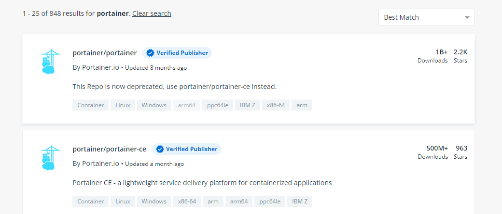

- -f: `YAML` 文件存放的地址，我将文件上传到了 **/yml/docker-compose/** 目录下，
- -p： 设置当前 `Docker Compose` 名称
- up： 根据配置文件重新构建服务，启动镜像。如果当前主机没有镜像，默认情况下会下载镜像（可以配置参数是否允许下载镜像），所以当主机中没有此 **portainer/portainer** 镜像时会进行下载，所有可能有些慢
- -d： 设置为后台运行，与 `docker run -d` 参数一致

在没有错误成功运行时，执行完毕后就会自动启动容器。


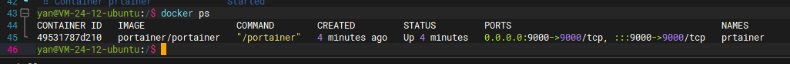

并且在挂载目录下可以看到与 `Portainer` 挂载的数据

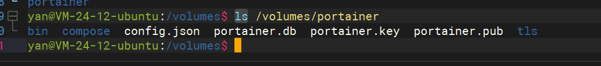

此时就可以使用网页访问 `Portainer` 页面。

注意：如果是云主机，需要启动 **9000** 端口访问策略，否则无法访问。

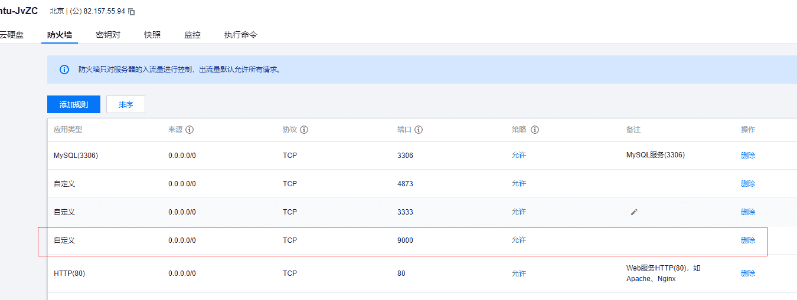

`Portainer` 第一次访问会跳转到设置管理员用户页面

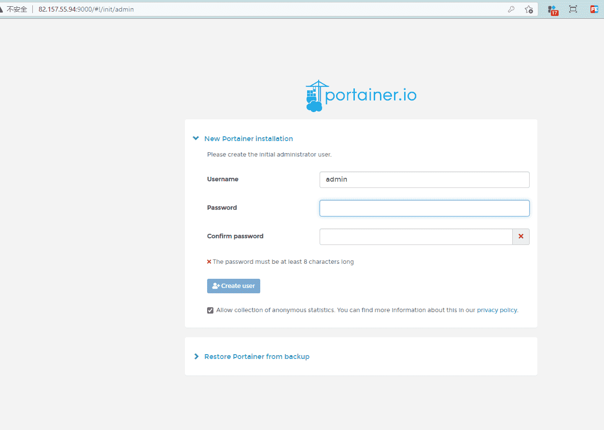

## Portainer 连接设置

设置管理员之后，页面会跳转到连接 `Docker` 页面

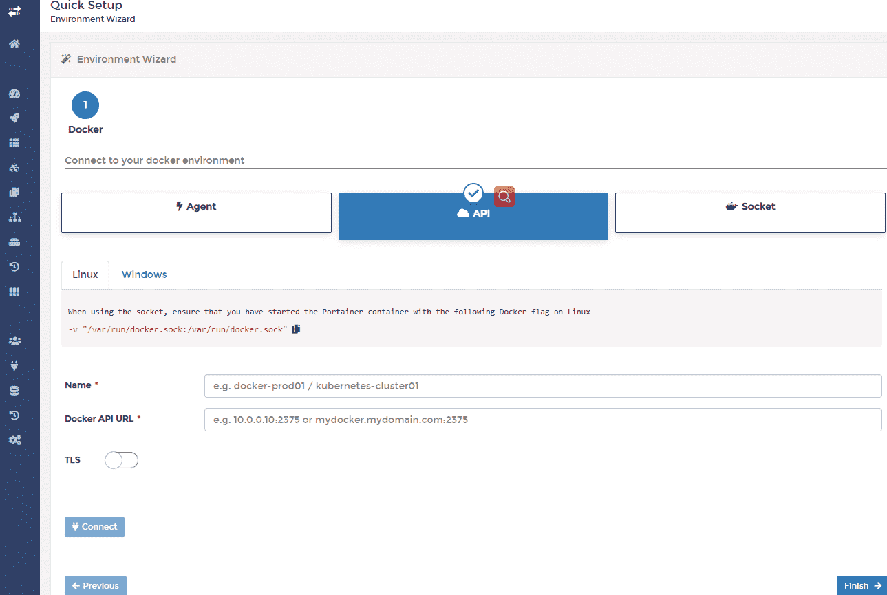

`Portainer` 提供了四种 `Docker` 连接方式，_本地连接_、_IP 连接_、 _代理连接_、_Azure 云连接_。
一般来说使用 _IP 连接_ 方式，当然也可以使用其它连接方式，例如是 `Portainer` 与 `Docker` 部署同一台机器
可以使用 _本地连接_， 在此使用 _IP 连接_ 方式

_IP 连接_ 方式是使用 `TCP` 协议访问的 **Docker API** 进行通信，需要设置 **Docker API**，允许 `Docker` 被访问

**Docker API** 的设置是 **/lib/systemd/system/docker.service** 文件中 **ExecStart** 属性

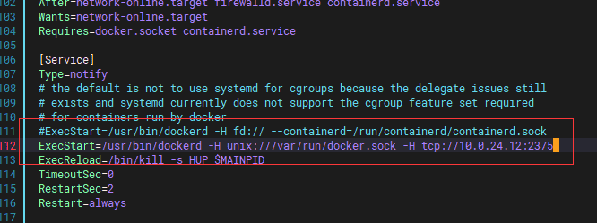

在此设置了当前主机的内网 IP 访问，其实只允许本地 IP 访问（模拟远程连接方式）

> 注意：设置 TCP 连接 千万不要设置为 **tcp://0.0.0.0:2375**，这样极大可能会中病毒，亲测中过挖矿脚本病毒。

设置完成后需要重启 `Docker` 服务

> sudo systemctl daemon-reload
> sudo systemctl restart docker

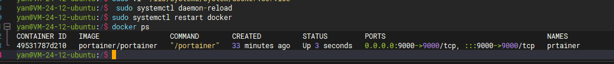

此时 就可以使用 `Portainer` 进行 _远程连接_

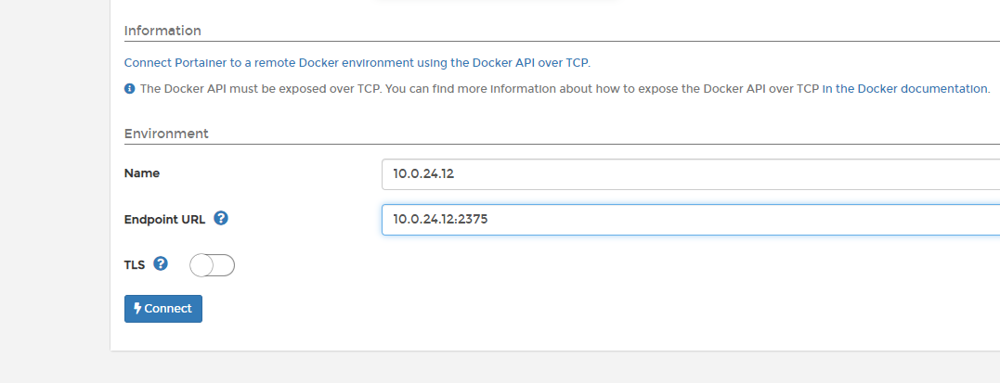

> 因为是内网连接，所以不需要启动 _TLS_

## Portainer 页面

连接 `Docker`后 就可以访问主页面

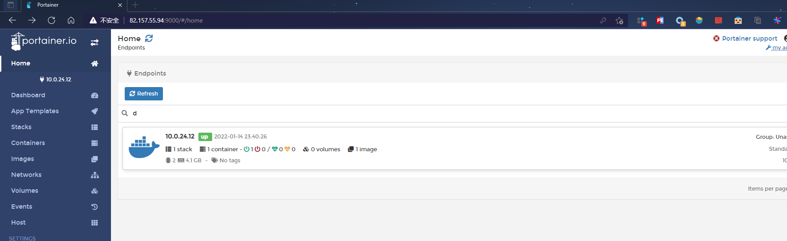

第一个便是刚才连接到的 `Docker` , 点击进去就可以看到 `Docker` 中的各种信息

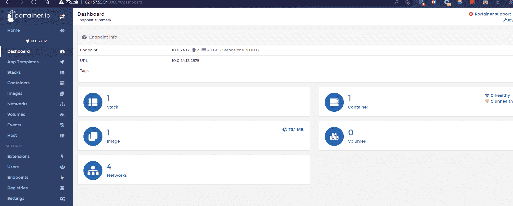

- Stack： `Docker Compose` 管理，对当前 `Docker Compose` 进行管理，并且可以直接上传 **YAML** 文件进行构建容器，目前只有一个 **portainer**
- Container：`Docker` 容器管理，可以对所有容器进行管理设置。目前容器也只有一个 portainer
- Image： `Docker` 镜像管理，对当前 `Docker` 所有镜像进行管理，目前也只有一个 portainer/portainer
- Volumes: `Docker` 数据卷管理，
- Networks： `Docker` network 管理，目前也只有默认的 4 个 network

### Stack 模块

**Stack** 是用来管理 `Docker Compose`，目前 `Docker Compose` 只有一个，也就是部署的 `Portainer`

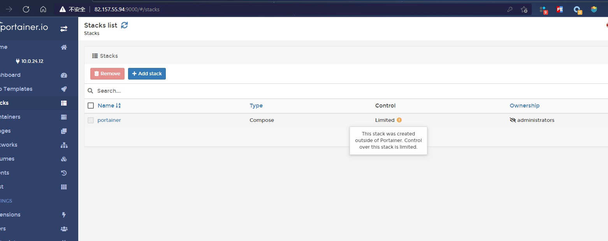

#### Limited

未使用 `Portainer`可视化工具部署的 `Docker Compose`， 在 `Portainer`可视化工具内部是不允许操作的。使用命令行部署的 **Portainer**， 在 `Portainer`可视化工具中的 _Control_ 属性显示为 **Limited**， 此属性的意思就是不允许进行任何操作。

### Add Stack

点击 **Add Stack** 按钮就可以进行添加 `Docker Compose`， `Portainer` 支持三种模式设置 `Docker Compose` 配置；

1.  Web editor（直接在当前页编写配置）
2.  Upload（提供本地上传 **xxx.yml** 文件）
3.  Repository（提供一个配置文件的 URL 地址）

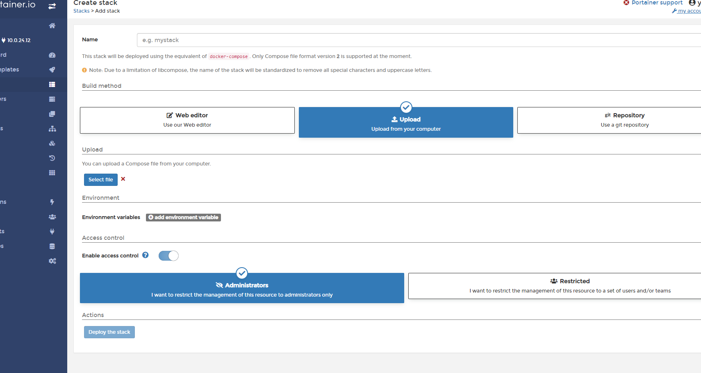

我比较喜欢使用 **Upload** 在本地使用编辑器编写配置进行上传。当然也可以使用另两种方式。看个人爱好。

### Docker Compose Version

在刚才部署 `Portainer` 所写的 `Docker Compose` 语法版本为 **3.8**, 但 `Portainer`可视化工具中在非 **Swarm 连接** 方式是不支持 **3.X** 语法版本，这个问题在 github 中被提到：[support compose version > 2 ](https://github.com/portainer/portainer/issues/2054)。

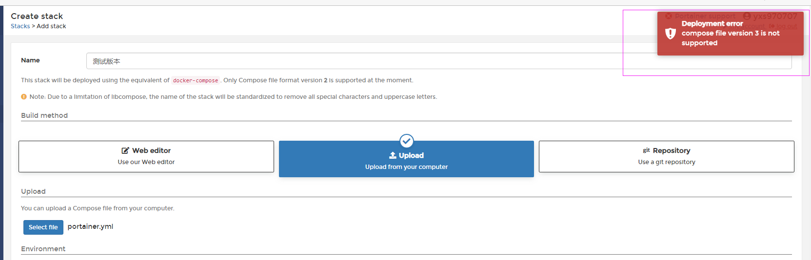

所有之后编写的 `Docker Compose` 语法版本都设置为 **2.4**

`Portainer` 其它功能可以自行点击查看，日常用到的功能也没多少。
